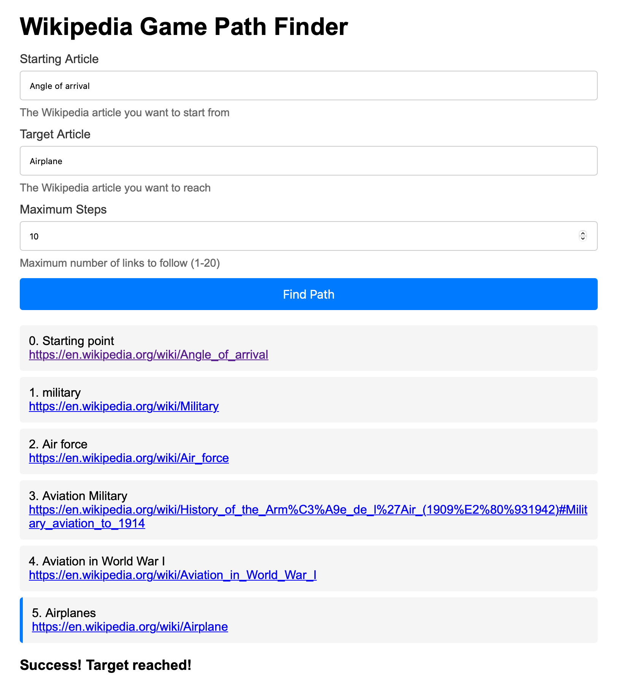

# Wikipedia Race
Finds a path between two Wikipedia articles.

## How it works
The Wikipedia Race game uses a language model (by default, GPT-4o-mini) to navigate from one Wikipedia article to the next. The goal is to find the shortest path from a starting article to a target article by always selecting links that lead closer to the target.

## Some details
   - The game starts by fetching the starting Wikipedia page and extracting all valid links.
   - The language model is given the set of links and is asked to choose the next link.
   - This process repeats until the target page is reached or a maximum number of steps is exceeded.
   - Deterministic logic is used to check whether the chosen link is actually present on the current site, as LLMs seem to have a tendency to hallucinate themselves to a quick win.

